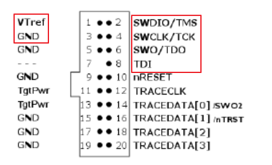
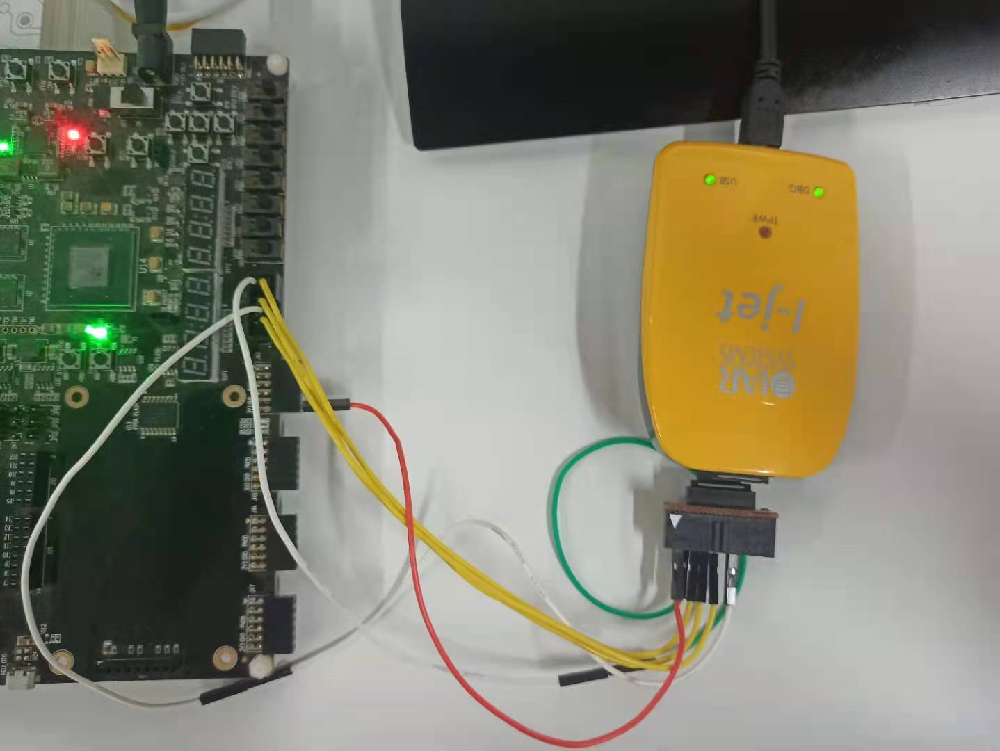

# Nuclei IAR Projects 使用说明

## 下载IAR EW for RISC-V

下载IAR EW for RISC-V并安装到本地，要求版本不低于`1.40.1` 。

## 克隆仓库到本地

打开windows command控制台，输入`git clone git@repo\link` 下载仓库到本地。

**注意**：根据实际仓库SSH或HTTPS修改`git@repo\link`内容。

## 在IAR中打开Nuclei IAR Projects

下载后双击NucleiExamples.eww文件即可启动IAR并打开Nuclei IAR Projects。

## 通过I-jet连接开发板

目前本工程仅支持使用I-jet下载调试，由于I-jet使用20pin mini接口，需要准备一个转接模块，方便进行跳线连接。

IAR与JTAG各接口对应关系如下图：

其中`VTref`需要单独接到开发板上3.3V的接口。

`SWDIO/TMS` 接到JTAG的`TMS`接口。

`SWCLK/TCK`接到JTAG的`TCK`接口。

`SWO/TDO`j接到JTAG的`TDO`接口。

`TDI`接到JTAG的`TDI`接口。

`GND`接到JTAG的`GND`接口。

如果使用`ADA-MIPI20-ARM20 adapter`其接口如下：

需要连接的引脚与上面一致。

参考连接实物图如下，图中使用的是`ADA-MIPI20-ARM20 adapter` 连接：

## 下载运行调试

IAR中打开Nuclei IAR Projects如下：

点击编译工程，连接好调试器，打开开发板电源，点击开始下载调试。调试界面如下：

有关调试的详细功能介绍，请参考IAR内菜单栏`Help -> C-SPY Debugging Guide`和`Help -> Debug Probes User Guide` 。

## 切换使用不同打印方式

在头文件`nuclei_demosoc.h`中可以通过修改`DEBUG_SEMIHOST`的值来选择使用哪种打印方式。如果使用Terminal I/O打印输出，此处应设置为1 。如果使用uart串口打印输出，需要设置为0，并且需要准备串口转usb工具连接uart输出到pc主机上。

